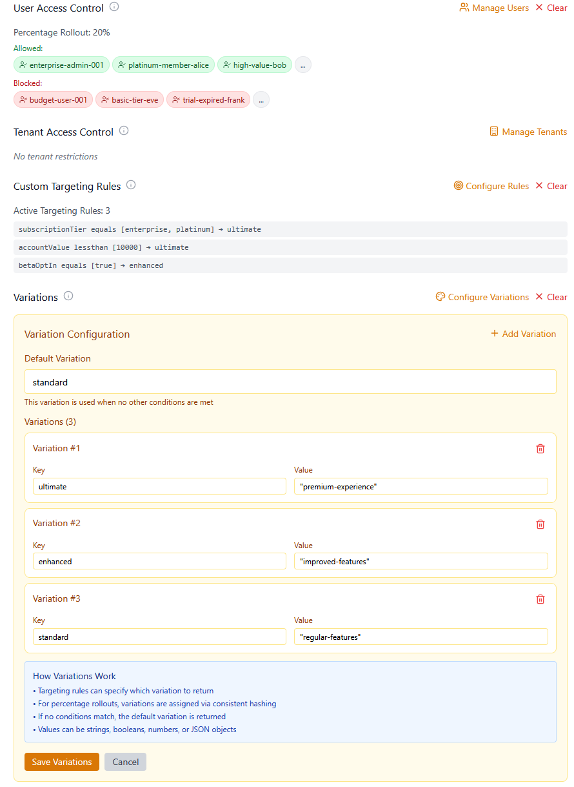

# Propel Feature Flags Dashboard

[](https://hub.docker.com/r/tasriyan/propel)
[](https://dotnet.microsoft.com/)
[](https://reactjs.org/)
[](LICENSE)

Web dashboard for managing feature flags. Single Docker container. .NET 9 + React.

> **CLI Tool:** [Propel CLI](https://github.com/Treiben/propel-cli) for terminal management and CI/CD

---

## Dashboard 

<details>
<summary>📸 Screenshots</summary>

### Feature Flags List


### Complex Flag


### Targeting Configuration


### User Access Control Configuration


### Variations Configuration


### Evaluation


</details>

---

## Quick Start

```bash
docker pull tasriyan/propel:latest

docker run -d \
  -p 8080:8080 \
  -e SQL_CONNECTION="Host=postgres;Database=propel;Username=user;Password=pass" \
  tasriyan/propel:latest
```

**Access:** http://localhost:8080  
**Login:** `admin` / `Admin123!`

[Full quick start →](docs/QUICKSTART.md)

---

## Features

- Feature flags with percentage rollouts, user targeting, tenant access control
- JWT authentication, role-based authorization
- Single container (Grafana-style)
- PostgreSQL or SQL Server
- Optional Redis caching with auto-invalidation
- Health checks, auto-migrations

---
### Managing Flags

**DO:**
- ✅ Use descriptive kebab-case keys: `new-payment-processor`
- ✅ Add meaningful names and descriptions
- ✅ Test in non-production first
- ✅ Use toggle for simple On/Off switches
- ✅ Use targeting rules and variations for complex evaluation logic

**DON'T:**
- ❌ Delete global flags without team approval
- ❌ Toggle flags with complex schedules (you'll lose the schedule)
- ❌ Use spaces or special characters in keys
- ❌ Create duplicate keys
- ❌ Delete application flags without deleting them in code base first (they restore automatically)

---

## Configuration

**Required:**
```bash
SQL_CONNECTION="Host=postgres;Database=propel;Username=user;Password=pass"
```

**Recommended for production:**
```bash
JWT_SECRET=$(openssl rand -base64 32)
DEFAULT_ADMIN_USERNAME=myadmin
DEFAULT_ADMIN_PASSWORD=StrongPass123!
```

**Optional:**
```bash
ALLOW_FLAGS_UPDATE_IN_REDIS=true
REDIS_CONNECTION=redis:6379
```

[All environment variables →](docs/ENVIRONMENT-VARS.md)

---

## Docker Compose

```bash
curl -O https://raw.githubusercontent.com/Treiben/propel-dashboard/main/docker-compose.release.yml

docker-compose -f docker-compose.release.yml up -d
```

With Redis:
```bash
docker-compose -f docker-compose.release.yml --profile with-redis up -d
```

---

## Architecture

Single container in production:

```
┌─────────────────────────────────────────┐
│  tasriyan/propel:latest                 │
│  ┌───────────────────────────────────┐  │
│  │   ASP.NET Core :8080              │  │
│  │   • API (/api/*)                  │  │
│  │   • Static Files (React)          │  │
│  └───────────────────────────────────┘  │
└─────────────────────────────────────────┘
```

[Architecture details →](docs/ARCHITECTURE.md)

---

## Database Support

**PostgreSQL:**
```bash
SQL_CONNECTION="Host=postgres;Port=5432;Database=propel;Username=user;Password=pass"
```

**SQL Server:**
```bash
SQL_CONNECTION="Server=sqlserver,1433;Database=propel;User Id=sa;Password=pass;TrustServerCertificate=True"
```

---

## Redis Caching

Optional. Enable for better performance:

```bash
ALLOW_FLAGS_UPDATE_IN_REDIS=true
REDIS_CONNECTION=redis:6379
```

**Important:** If your apps cache flags in Redis, dashboard must connect to same Redis instance. Dashboard auto-invalidates cache when flags update.

---

## Deployment

**Kubernetes:**
```yaml
apiVersion: apps/v1
kind: Deployment
metadata:
  name: propel-dashboard
spec:
  replicas: 2
  template:
    spec:
      containers:
      - name: dashboard
        image: tasriyan/propel:latest
        ports:
        - containerPort: 8080
        env:
        - name: SQL_CONNECTION
          valueFrom:
            secretKeyRef:
              name: propel-secrets
              key: sql-connection
        livenessProbe:
          httpGet:
            path: /api/health/live
            port: 8080
        readinessProbe:
          httpGet:
            path: /api/health/ready
            port: 8080
```

[Full deployment guide →](docs/DEPLOYMENT.md)

---

## Health Checks

- `/api/health/live` - Liveness (is running?)
- `/api/health/ready` - Readiness (accepting traffic?)
- `/api/health` - All checks

---

## Development

```bash
# Start dev environment (hot reload)
docker-compose up -d

# API: http://localhost:5038
# UI: http://localhost:3000
```

**Structure:**
```
propel-dashboard/
├── dashboard-api/          # .NET 9 API
│   ├── Dockerfile
│   └── Dockerfile.production
├── dashboard-react/        # React + TypeScript
│   ├── src/
│   └── vite.config.ts
├── docker-compose.yml      # Dev
├── docker-compose.release.yml  # Prod
└── Makefile
```

**Build commands:**
```bash
make build          # Build production image
make run            # Run with docker-compose
make logs           # View logs
make test           # Health checks
make clean          # Clean up
```

---

## Security

1. **Set JWT secret:**
   ```bash
   JWT_SECRET=$(openssl rand -base64 32)
   ```

2. **Change admin credentials**

3. **Use HTTPS** (reverse proxy)

4. **Disable auto-seeding after first run:**
   ```bash
   SEED_DEFAULT_ADMIN=false
   ```

---

## Versioning

[Docker Hub](https://hub.docker.com/r/tasriyan/propel) | [GitHub Packages](https://github.com/Treiben/propel-dashboard/pkgs/container/propel-dashboard)

**Tags:**
- `latest` - Latest stable
- `v1.0.0` - Specific version
- `v1.0` - Latest patch
- `v1` - Latest minor

---

## Related

**[Propel CLI](https://github.com/Treiben/propel-cli)** - Command-line flag management, database migrations, CI/CD automation

---

## Contributing

1. Fork
2. Create branch (`git checkout -b feature/thing`)
3. Commit (`git commit -m 'Add thing'`)
4. Push (`git push origin feature/thing`)
5. Open PR

---

## License

Apache License 2.0 - see [LICENSE](LICENSE)

---

## Support

- 📖 [Documentation](docs/)
- 🐛 [Issues](https://github.com/Treiben/propel-dashboard/issues)
- 💬 [Discussions](https://github.com/orgs/Treiben/discussions)

---

**Inspired by [Grafana](https://grafana.com/)'s single-container architecture**

**Made with ❤️ by Tatyana Asriyan**